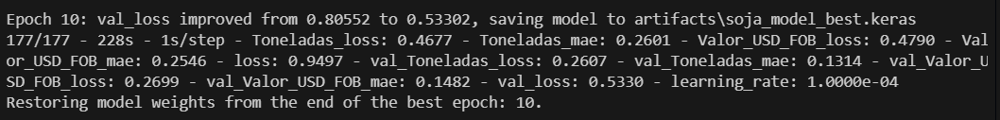
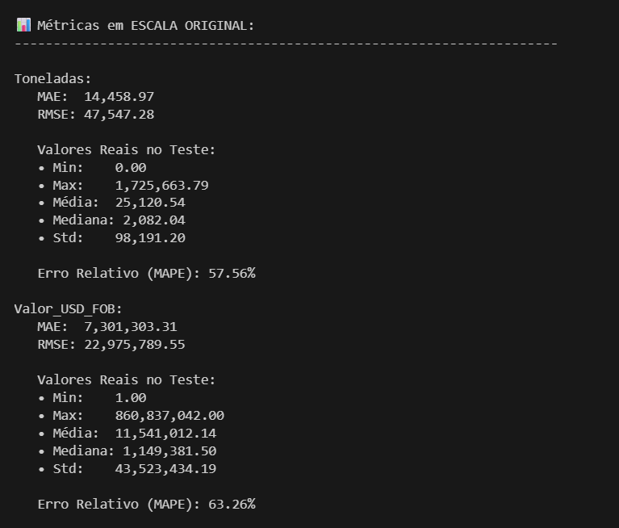
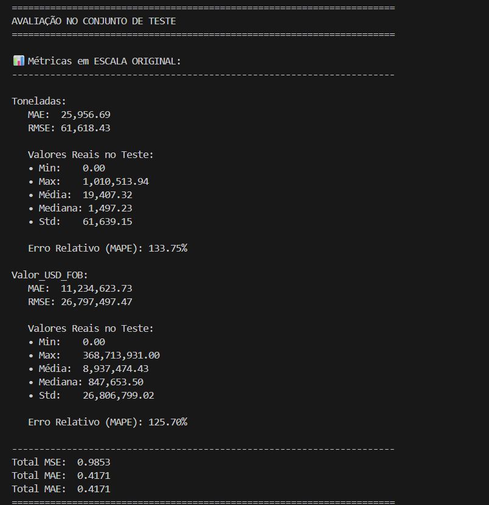
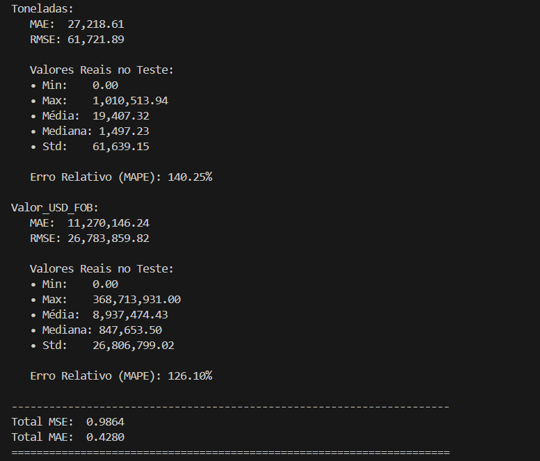
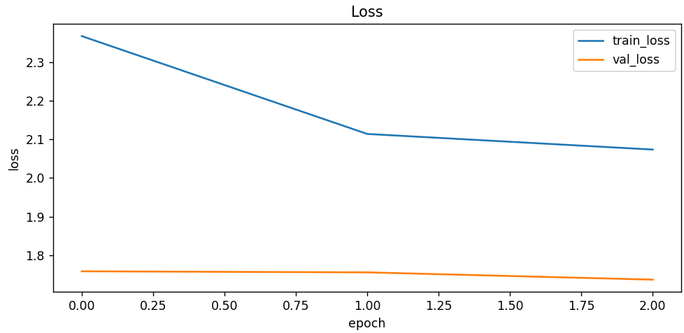

# Projeto Final — Deep Learning
## 1. Regressão Multivariada
**Tarefa**: Prever Toneladas movimentadas e Valor US$ FOB a partir de dados de comércio exterior, incluindo características logísticas informações fiscais e alfandegárias distância, tempo estimado, NCM, UF, países

**Contexto:** Modelagem de fluxos internacionais e previsão de demanda logística/comercial

**Métrica(s):** MAE/RMSE/MAPE
## 2. Dados 
**Fonte:** Banco de dados do comércio exterior brasileiro (parquet consolidado gerado pelo aluno).
**Tamanho:** ~16k de linhas e + de 80 features apos o one hote coding
**Pré-processamento:** 

- Limpeza de nomes de colunas

- Conversão de tipos numéricos

- Extração de mês (numérico)

- Encoding de categóricas via one-hot

- Remoção de linhas com NaN em variáveis-alvo

- Remoção automática de outliers extremos no “Valor US$ FOB” (quantile 99.5%)

- Normalização dos dados com StandardScaler

**Split** em:

- Treino: 70%

- Validação: 15%

- Teste: 15%

## 3. Modelo e Treinamento- 
**Arquitetura:** MLP/Transformer 
**Hiperparâmetros chave:** 
- batch_size: 64
- lr: 5e-4
- epochs: 10/15
- dropout: 0.1
- head_size: 64
- num_heads: 8
- num_blocks = 3

**Config:** config.yaml- 
**Reprodutibilidade:** 
- seeds fixas para PyTorch, NumPy e Python
- PyTorch 2.x + CUDA (quando disponível)
### Como rodar

pip install -r requirements.txt

python train_soja.py --config config.yaml

## 4. Resultados com Transformer Tabular

**Teste com Tranformers Tabular(com outlier)**

Esse resultado apresenta um teste feito com a arquitetura transformer, porém. Para esse teste não foi retirado os outliers, o que pode ter impactado diretamente os resultados.

**Teste com Transformers Tabular(Sem Outlier)**

**Teste com o modelo de MLP e 3 epochs**

### 4.1 - Análise crítica dos resultados

Os modelos desenvolvidos (MLP e Transformer Tabular) apresentaram erros relativamente altos — especialmente para o target Valor US$ FOB.
Isso não indica necessariamente uma falha no modelo, e sim limitações estruturais do dataset de comércio exterior.

Motivos principais que explicam a baixa performance
1) Alta assimetria e cauda pesada (heavy tail) no Valor FOB

Mesmo após remover o quantile 99.5%, o dataset ainda apresenta valores como:

- Mediana: 1,1 milhão

- Média: 11,5 milhões

- Máximo: 860 milhões

Essa distribuição inviabiliza que o modelo aprenda padrões consistentes, porque pequenas variações percentuais significam diferenças enormes em valor absoluto.

Modelos tabulares sofrem muito com isso.

## 5. Limitações e Próximos Passos- (curto e objetivo)
- Dados de comércio exterior apresentam forte assimetria → valores FOB muito altos ainda podem afetar o treinamento.

- Necessário mais dados externos

- Possível melhorar o modelo incorporando:

- modelos híbridos (Deep Learning + PINNs)

- atenção cruzada entre features numéricas e categóricas

- embeddings treináveis para País, NCM e UF

- arquitetura temporal mais profunda

- Criar sistema de previsão contínua (streaming)
- Explorar melhor técnicas robustas para outliers (Tukey, winsorizing adaptativo)
- Criar um modelo apenas para os outliers

## 6. Autores- Nome(s), matrícula(s), curso(s)
Nome: Jefferson Kauan Cavalcante Chaves
Matricula: 202310307611
Curso: Ciencia da Computação - UERJ